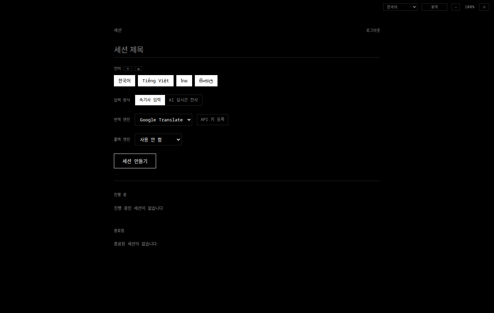
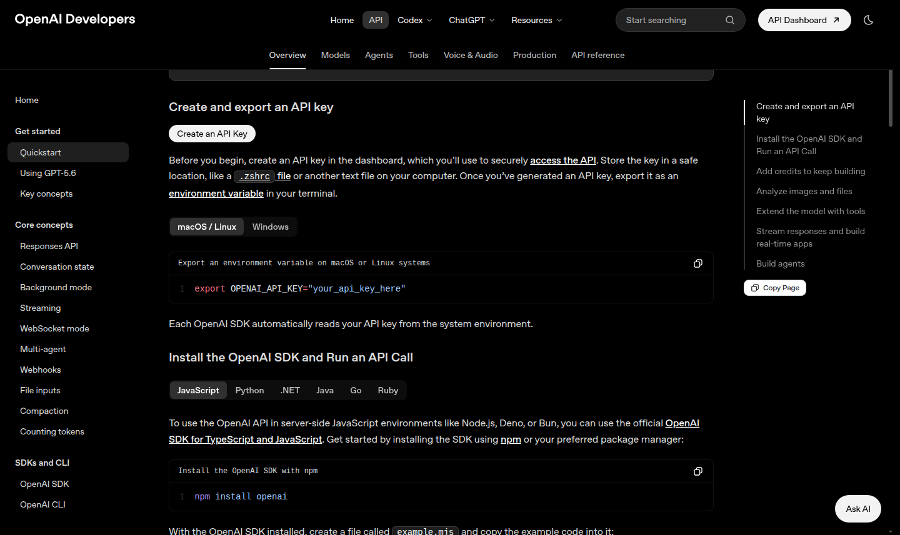
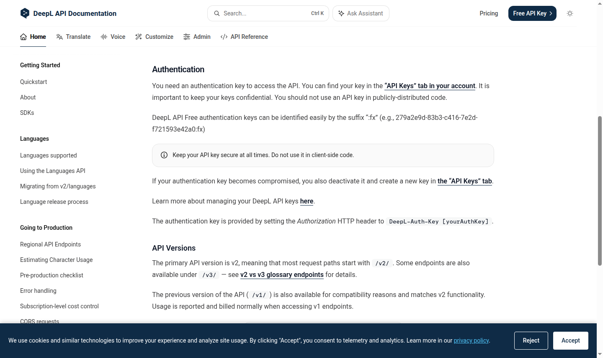
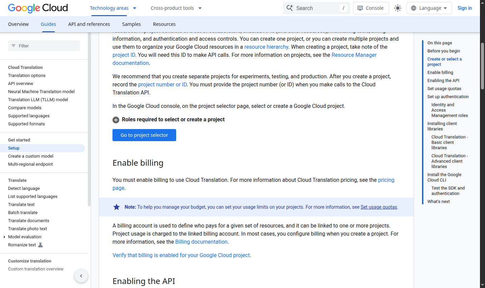
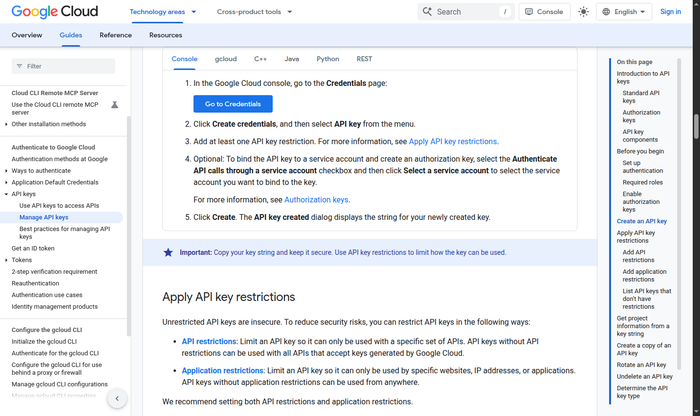
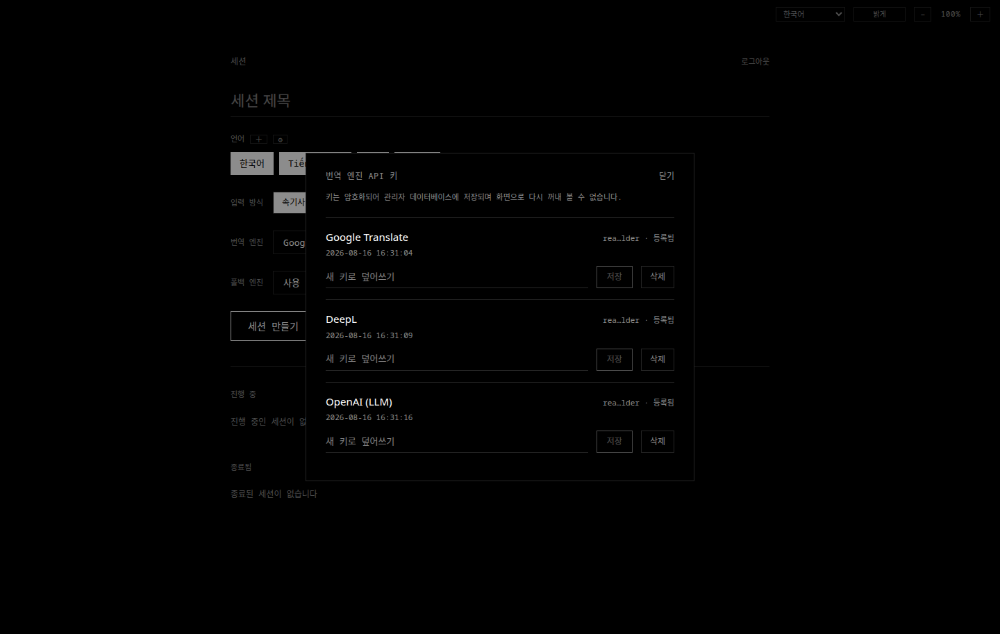
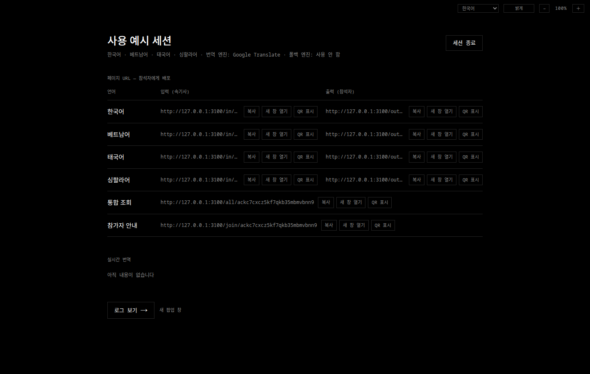
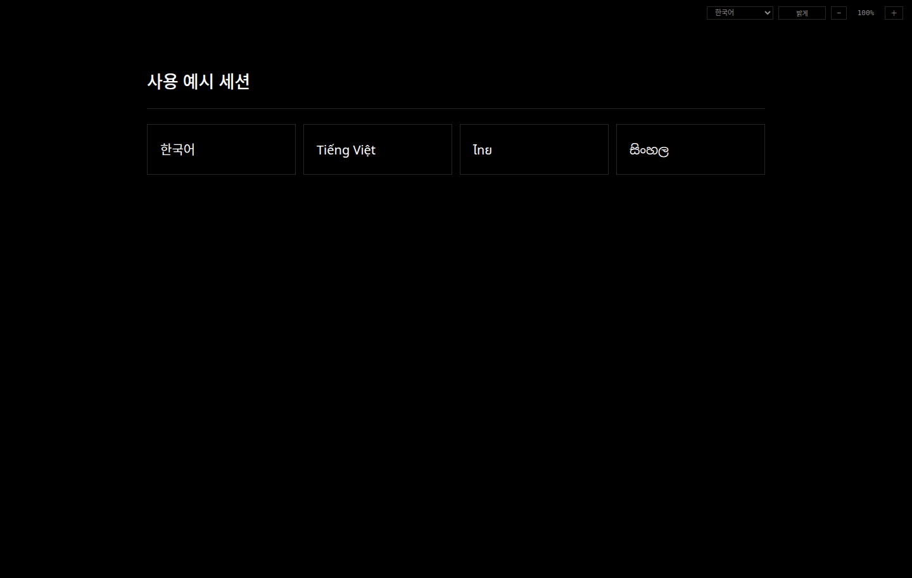

# Live Conference Translation

여러 언어가 함께 쓰이는 현장에서 **사람이 입력한 문장 또는 마이크 음성을 실시간으로
번역해 휴대전화로 전달하는 프로그램**입니다.

진행자는 관리자 화면에서 세션을 만들고, 언어별 입력·출력 주소와 QR 코드를 배포합니다.
참석자는 앱을 설치하지 않고 자기 언어 링크만 열어 새 번역을 계속 받아볼 수 있습니다.

이 프로젝트는 **OpenAI Codex를 활용해 개발한 도구**입니다.



## 목차

- [누가 어떤 화면을 쓰나요?](#누가-어떤-화면을-쓰나요)
- [가장 쉬운 시작: Windows 설치본](#가장-쉬운-시작-windows-설치본)
- [완전 로컬 AI 설치](#완전-로컬-ai-설치)
- [Windows 관리자 비밀번호 복구·변경](#windows-관리자-비밀번호-복구변경)
- [API 키 준비](#api-키-준비)
  - [OpenAI](#openai-api-키)
  - [DeepL](#deepl-api-키)
  - [Google Cloud Translation](#google-cloud-translation-api-키)
- [앱에 API 키 등록](#앱에-api-키-등록)
- [첫 세션 만들기](#첫-세션-만들기)
- [세션 운영 설정과 프리셋](#세션-운영-설정과-프리셋)
- [참가자에게 링크와 QR 배포](#참가자에게-링크와-qr-배포)
- [속기사 입력 모드](#속기사-입력-모드)
- [AI 실시간 전사 모드](#ai-실시간-전사-모드)
- [번역 엔진과 폴백 엔진](#번역-엔진과-폴백-엔진)
- [Cloudflare 공개 URL](#cloudflare-공개-url)
- [언어·화면 문구 관리](#언어화면-문구-관리)
  - [번역 단어집 사용](#번역-단어집-사용)
- [세션 종료·로그·삭제](#세션-종료로그삭제)
- [백업과 복구](#백업과-복구)
- [보안과 비용 확인사항](#보안과-비용-확인사항)
- [문제 해결](#문제-해결)
- [개발자를 위한 소스 실행](#개발자를-위한-소스-실행)
- [구조와 기술적 배경](#구조와-기술적-배경)
- [시스템 요구사항과 예상 동시 접속 부하](#시스템-요구사항과-예상-동시-접속-부하)

## 누가 어떤 화면을 쓰나요?

이 프로그램은 한 세션마다 역할이 다른 페이지를 자동으로 만듭니다.

| 사용자 | 받는 주소 | 하는 일 |
| --- | --- | --- |
| 관리자 | `/admin` | API 키 등록, 언어 선택, 세션 생성·종료·삭제, 로그 확인 |
| 속기사 | `/in/<토큰>` | 타자·검토형 음성 입력·자동 음성 입력 중 하나로 원문을 입력 |
| 다국어 입력 담당자 | `/in/all/<토큰>` | 한 페이지에서 타자·마이크 언어를 자동 감지해 입력 |
| AI 음성 수집 담당자 | `/capture/<토큰>` | 이전 AI 전사 세션에서 한 언어의 음성을 자동 전사 |
| 일반 참석자 | `/out/<토큰>` | 선택한 한 언어의 번역만 읽기 |
| 운영 모니터 | `/all/<토큰>` | 모든 원문과 번역을 한 화면에서 확인 |
| 참가자 안내 | `/join/<토큰>` | 세션 제목과 언어 버튼을 보고 자기 언어 출력 페이지로 이동 |

새 세션은 언어별 입력·출력 페이지와 통합 조회 주소를 준비합니다. 실제로 사용할 입력·출력
페이지는 세션 세부 화면에서 언어별로 켜고 끕니다. 입력 페이지 하나에서 타자, 검토 후
보내는 수동 STT, 즉시 보내는 자동 음성 입력을 선택할 수 있습니다. `/capture` 주소는 이전
버전에서 만든 AI 전사 세션과의 호환을 위해 유지됩니다.

## 가장 쉬운 시작: Windows 설치본

Windows 설치본은 Node.js나 개발 도구를 따로 설치하지 않아도 됩니다.
설치 프로그램은 설치 범위와 설치 폴더를 고른 뒤 로컬 AI 모델을 선택합니다.
바탕 화면 바로가기는 설치 마법사에서 선택하며 기본값은 꺼짐입니다.
(기본값: 만들지 않음). Windows 정책상 작업 표시줄 고정은 자동으로 하지 않으므로 필요하면
실행 중인 앱 아이콘을 우클릭해 직접 고정하세요.

### 1. 설치 또는 포터블 실행

[v0.9.17 릴리스 페이지](https://github.com/Levi02114/LiveConfTranslation/releases/tag/v0.9.17)에서 다음 중
하나를 내려받습니다.

- `... Setup ... .exe`: Windows에 설치하는 버전
- `... .exe`: 설치 없이 실행하는 포터블 버전(온라인 엔진 전용)

둘 중 하나만 사용하면 됩니다. 한 컴퓨터에서 두 버전을 동시에 실행하지 마세요.
현재 배포본은 상용 코드 서명 인증서로 서명하지 않았으므로 Windows SmartScreen 경고가
나타날 수 있습니다. 이 저장소의 Releases에서 받은 파일과 공개된 SHA-256이 일치하는지
확인한 뒤 실행하세요.

### 2. 처음 실행할 때 관리자 비밀번호 보관

첫 실행 시 프로그램이 무작위 관리자 비밀번호를 만들고 팝업으로 한 번 보여 줍니다.

1. **비밀번호 복사**를 누릅니다.
2. 비밀번호 관리자 또는 안전한 내부 문서에 저장합니다.
3. 관리자 로그인 화면에 붙여 넣습니다.

프로그램은 같은 시점에 다음 항목도 자동으로 준비합니다.

- 관리자 로그인 세션에 사용할 비밀키
- SQLite 데이터베이스
- 로컬 웹 서버 `http://<이 컴퓨터의 LAN 주소>:3000`
- 설치형에서 쓸 로컬 HTTPS 인증서와 Windows 현재 사용자 신뢰 저장소

설치본에는 `.env.local`이 필요하지 않습니다.

### 3. 방화벽 메시지 허용

Windows Defender 방화벽이 네트워크 접근을 물으면 **개인 네트워크**만 허용하세요.
공용 네트워크 허용은 권장하지 않습니다.

같은 Wi-Fi 또는 유선망에 연결된 휴대전화에서 페이지가 열리지 않으면 먼저 다음을
확인합니다.

1. 컴퓨터와 휴대전화가 같은 네트워크인지 확인
2. 게스트 Wi-Fi의 기기 간 통신 차단 기능이 켜져 있지 않은지 확인
3. Windows 방화벽에서 이 앱의 개인 네트워크 접근이 허용됐는지 확인

## 완전 로컬 AI 설치

Windows **설치형**은 같은 설치 파일에서 온라인 API 방식과 완전 로컬 방식을 함께
사용할 수 있습니다. 별도의 `-local` 배포판은 없습니다. 포터블은 실행 속도와 크기를
유지하기 위해 온라인 엔진만 지원합니다.

Windows 설치 마법사에서 전체 사용자/현재 사용자와 설치 폴더를 고른 다음 **로컬 AI**
단계가 나타납니다. 로컬 AI 설치 여부를 고르고 번역·음성 인식 모델을 드롭다운에서
선택합니다. 컴퓨터 메모리에 맞춘 권장 모델이 기본으로 선택됩니다. 모델과 임시 파일은
`LiveConfTranslation` 사용자 데이터 폴더 아래에 자동으로 생성됩니다. 모델 파일을 받는 동안만 인터넷 연결이
필요하며, 설치가 끝난 뒤에는 로컬 번역과 로컬 음성 인식 자체에 인터넷이 필요하지
않습니다. 설치 후 Electron 설정 메뉴에서 모델을 별도로 다운로드하거나 교체하지 않습니다.

1. 설치기가 시스템 RAM을 확인해 권장 번역·음성 인식 모델을 기본 선택합니다.
2. 두 드롭다운을 확인하고 필요하면 다른 모델을 선택합니다.
3. Gemma 사용 조건을 열어 확인하고 동의합니다.
4. 설치 진행 화면에서 다운로드가 끝날 때까지 설치 프로그램을 닫지 않습니다. 중단되면
   다시 설치할 때 `.part` 파일에 이어 받습니다.
5. SHA-256 검증과 압축 해제가 모두 끝나야 설치가 완료되고 관리자 화면의 Local AI
   선택지가 활성화됩니다.

| 용도 | 선택지 | 대략적인 모델 크기 | 권장 기준 |
| --- | --- | ---: | --- |
| 번역 | TranslateGemma 4B Q4_K_M | 2.5 GB | RAM 20 GB 미만 |
| 번역 | TranslateGemma 12B Q4_K_M | 7.3 GB | RAM 20 GB 이상 또는 VRAM 10 GB 이상 |
| 번역 | TranslateGemma 27B Q4_K_M | 16.5 GB | RAM 40 GB 이상 또는 VRAM 20 GB 이상 |
| 음성 인식 | Whisper small | 488 MB | 기본값, 저사양 CPU |
| 음성 인식 | Whisper medium | 1.5 GB | RAM 16 GB 이상, 정확도 우선 |

번역은 `llama.cpp`의 Vulkan GPU 가속을 자동으로 사용하고, 모델이 VRAM을 넘으면
자동 맞춤으로 GPU 레이어를 줄이며 GPU를 쓸 수 없으면 CPU로 동작합니다. 음성 인식은
`whisper.cpp`와 기존 브라우저 VAD·PCM WebSocket 경로를 재사용해
부분 전사와 문장 확정을 제공합니다. 로컬 런타임은 실제로 Local AI를 선택한 세션에서
처음 필요할 때만 `127.0.0.1`에 시작되고 앱 종료 시 함께 종료됩니다.

사용 구성요소와 모델 출처는 다음과 같습니다. 설치기는 버전별 고정 URL과 SHA-256을
사용해 검증합니다.

- `llama.cpp`: <https://github.com/ggml-org/llama.cpp>
- `whisper.cpp`: <https://github.com/ggml-org/whisper.cpp>
- TranslateGemma GGUF 양자화: <https://huggingface.co/mradermacher/translategemma-4b-it-GGUF>
- Whisper 모델: <https://huggingface.co/ggerganov/whisper.cpp>

관리자에서 세션을 만들 때 **번역 엔진**과 **음성 인식 엔진**을 따로 고릅니다. 둘 다
Local AI를 골라야 완전 오프라인입니다. Local AI와 온라인 폴백을 함께 고르면 하이브리드
운영이므로 네트워크와 해당 API 키가 필요합니다. 앱은 사용자가 선택하지 않은 온라인
엔진으로 몰래 우회하지 않습니다. 로컬 Whisper가 설치된 첫 실행에서는 이를 음성 인식
기본값으로 선택하고, 이후에는 관리자가 마지막으로 고른 음성 인식 엔진을 유지합니다.

> Local AI는 TranslateGemma에 별도의 지원 언어 조회 API가 없어 등록한 언어를 수동 목록으로
> 미리 차단하지 않고 모델에 전달합니다. 공식 학습 범위 밖 언어는 품질이 다를 수 있으며,
> Local AI 번역에는 관리자 단어집이 적용되지 않습니다.

### 로컬 HTTPS와 휴대전화 마이크

설치형은 자체 서명한 로컬 CA와 서버 인증서를 현재 Windows 사용자 신뢰 저장소에
준비하고 LAN 공유 주소를 `https://<주소>:3443`으로 표시합니다. 관리자 컴퓨터에서는
바로 신뢰되지만 휴대전화에는 CA가 없으므로 첫 접속 시 위험 경고가 나타날 수 있습니다.
첫 인증서 생성 때 Windows가 로컬 CA 신뢰 여부를 물으면 허용해야 설정이 완료됩니다.

1. Electron의 **설정 → 휴대전화용 로컬 HTTPS 인증서 받기**를 엽니다.
2. 휴대전화로 표시된 HTTP 다운로드 주소를 열어 `.cer` 파일을 받습니다.
3. 운영체제의 인증서 설치 화면에서 이 행사 네트워크용 CA를 신뢰합니다.
4. 세션의 HTTPS 입력 주소를 다시 엽니다.

CA를 설치하면 그 인증서를 만든 컴퓨터를 신뢰하게 됩니다. 관리하는 기기에만 설치하고,
행사가 끝난 뒤 필요 없으면 운영체제의 사용자 인증서 설정에서 제거하세요. 인증서 설치가
곤란하거나 외부 네트워크에서도 접속해야 하면 [Cloudflare 공개 URL](#cloudflare-공개-url)을
사용하는 편이 쉽습니다.

인증서 생성에 실패하면 앱이 원인을 알리고 HTTP로 계속 실행합니다. 설치형 앱을 다시
시작하면 인증서 설정을 재시도하며, 성공하면 공유 주소가 `https://...:3443`으로 바뀝니다.

## Windows 관리자 비밀번호 복구·변경

관리자 화면 우측 상단에서 **비밀번호 변경**을 누르면 앱을 재설치하거나 설정 파일을
편집하지 않고 비밀번호를 바꿀 수 있습니다.

1. 현재 비밀번호를 입력합니다.
2. 12~128자의 새 비밀번호를 두 번 입력합니다.
3. **변경**을 누릅니다.

새 비밀번호는 평문이 아니라 `meetings.db.admin-auth.json`에 해시로 저장됩니다. 현재
브라우저는 계속 로그인되어 있고, 다른 브라우저의 관리자 로그인과 관리자 대시보드 연결은
모두 무효가 됩니다. 번역 API 키 암호화에 쓰는 `sessionSecret`은 바뀌지 않습니다.

비밀번호를 잊었거나 인증 파일이 손상된 경우에는 초기 비밀번호로 복구합니다.

1. Live Conference Translation 창을 닫아 앱을 완전히 종료합니다.
2. `Windows 키 + R`을 누르고 `%APPDATA%\Live Conference Translation`을 입력한 뒤
   Enter를 누릅니다.
3. `meetings.db.admin-auth.json` 파일만 삭제합니다.
4. `desktop-settings.json`을 메모장으로 열어 `adminPassword`의 초기 비밀번호를 확인합니다.
5. 앱을 다시 실행한 뒤 초기 비밀번호로 로그인하고 관리자 화면에서 새 비밀번호를 설정합니다.

```json
{
  "adminPassword": "처음_실행할_때_생성된_비밀번호",
  "sessionSecret": "기존_값을_그대로_유지"
}
```

> **중요:** `sessionSecret`은 수정하거나 삭제하지 마세요. 이 값이 바뀌면 기존 로그인
> 쿠키가 무효가 되고 SQLite에 저장된 번역 API 키도 복호화할 수 없어 모두 다시
> 등록해야 합니다. `desktop-settings.json` 전체를 삭제하지 말고 관리자 인증 파일만
> 삭제하세요.

소스 실행에서는 앱을 종료하고 기본 경로의 `data/meetings.db.admin-auth.json` 또는
`DATABASE_PATH` 뒤에 `.admin-auth.json`이 붙은 파일을 삭제합니다. 재시작하면
`.env.local`의 `ADMIN_PASSWORD`가 다시 초기 비밀번호가 됩니다.

## API 키 준비

온라인 번역·OpenAI 음성 인식을 쓸 때는 사용할 서비스의 API 키가 필요합니다. 번역과
음성 인식을 모두 Local AI로 선택하면 API 키가 없어도 됩니다.
API 키 발급과 사용에는 각 서비스의 계정·결제·사용량 정책이 적용됩니다.

### 무엇을 준비하면 되나요?

| 사용 목적 | 필요한 키 |
| --- | --- |
| 넓은 언어 지원과 빠른 기계 번역 | Google Cloud Translation |
| DeepL이 지원하는 언어의 기계 번역 | DeepL API |
| 문맥을 반영한 LLM 번역 | OpenAI API |
| AI 실시간 음성 전사 | OpenAI API 필수 |
| 완전 로컬 번역·음성 인식 | API 키 없음, 설치형의 로컬 모델 필요 |
| DeepL 미지원 언어를 자동으로 다른 엔진에 맡기기 | DeepL + 폴백용 Google 또는 OpenAI |

키를 세 개 모두 만들 필요는 없습니다. 처음 시험할 때는 사용할 엔진 하나만 등록해도
됩니다. 다만 실제 행사 전에는 주 엔진과 **서로 다른 폴백 엔진**을 함께 준비하는 편이
안전합니다.

> ChatGPT Plus/Pro 구독과 OpenAI API 결제는 별도입니다. ChatGPT를 유료로 쓰고 있어도
> API 사용 가능 잔액이나 결제 수단을 별도로 확인해야 합니다.

### API 키 공통 안전수칙

- 키를 메신저, 이메일, 문서, 화면 공유에 그대로 노출하지 마세요.
- README, 소스 코드, `.env.local`, Git 커밋에 키를 넣지 마세요.
- 이 앱의 **관리자 화면 → API 키 등록**에만 붙여 넣으세요.
- 노출이 의심되면 해당 서비스에서 즉시 키를 폐기하고 새 키를 발급하세요.
- 행사 전 사용 한도·예산 경고를 설정하세요.

## OpenAI API 키

OpenAI는 이 앱에서 두 가지 용도로 쓰입니다.

1. 앞 문장의 문맥을 함께 고려하는 LLM 번역
2. 마이크 음성을 텍스트로 바꾸는 AI 실시간 전사

공식 시작 문서: <https://developers.openai.com/api/docs/quickstart>



### 발급 순서

1. <https://platform.openai.com/>에 로그인합니다.
2. API 대시보드에서 프로젝트를 선택하거나 새 프로젝트를 만듭니다.
   - 행사·기관별 비용을 구분하려면 이 앱 전용 프로젝트를 만드는 편이 좋습니다.
3. **API keys** 페이지를 엽니다.
   - 직접 주소: <https://platform.openai.com/api-keys>
4. **Create new secret key** 또는 **Create an API Key**를 누릅니다.
5. 알아보기 쉬운 이름을 입력합니다. 예: `conference-translation-main`
6. 권한을 선택합니다.
   - 앱은 번역에 `gpt-5.6-luna`만 사용합니다.
   - 제한 키를 만들었다면 `gpt-5.6-luna`, Chat Completions, Realtime 사용 권한이 막히지
     않았는지 확인하세요.
7. 생성된 키를 즉시 복사합니다.
   - 전체 키는 보통 생성 직후에만 표시됩니다.
   - 이 키를 채팅창이나 README에 붙이지 마세요.
8. **Billing**에서 결제 수단 또는 크레딧을 확인합니다.
   - 공식 시작 문서의 **Go to billing** 링크를 이용해도 됩니다.
9. 가능하면 프로젝트의 월 예산과 알림을 설정합니다.

### `gpt-5.6-luna` 번역이 실패할 때

- OpenAI 번역 모델은 `gpt-5.6-luna`로 고정되어 다른 모델을 선택할 수 없습니다.
- 키를 등록한 프로젝트에서 이 모델과 Chat Completions를 사용할 수 있는지 확인합니다.
- `429 insufficient_quota`가 보이면 키 폐기가 아니라 프로젝트 크레딧·결제 문제입니다.

## DeepL API 키

DeepL 웹 번역기 구독이 아니라 **DeepL API 플랜**이 필요합니다. 기존 DeepL Translator
계정만 있는 경우 API 플랜 가입 여부를 별도로 확인하세요.

공식 시작 문서:

- <https://developers.deepl.com/docs/getting-started/quickstart>
- <https://developers.deepl.com/docs/getting-started/auth>
- <https://developers.deepl.com/docs/multiple-api-keys>



### 발급 순서

1. DeepL API 요금제 페이지에서 API Free 또는 필요한 유료 API 플랜에 가입합니다.
2. DeepL 계정에 로그인합니다.
3. **Account**를 열고 **API Keys & Limits** 또는 **API Keys** 탭으로 이동합니다.
4. 기존 활성 키를 복사하거나 **Create key**를 누릅니다.
5. 키 이름을 입력합니다. 예: `live-session-translation`
6. 생성 팝업에서 키를 복사합니다.
   - 목록에는 전체 키가 숨겨질 수 있으므로 복사 버튼을 사용합니다.
7. 유료 플랜이면 월 비용 상한 또는 키별 사용량 제한을 설정합니다.

### Free와 Pro 키 차이

- DeepL API Free 키는 일반적으로 `:fx`로 끝납니다.
- 이 앱은 `:fx`를 자동 감지해 `api-free.deepl.com`을 사용합니다.
- 유료 API 키는 기본 `api.deepl.com`을 사용합니다.
- 사용자가 URL을 직접 바꿀 필요는 없습니다.

### 지원하지 않는 언어

DeepL은 모든 언어를 지원하지 않습니다. 예를 들어 현재 기본 언어 중 싱할라어는
DeepL 대상 언어가 아닙니다.

이 앱은 고정 목록만 믿지 않고 DeepL의 `/v2/languages` API에서 실제 지원 언어를
조회하고 24시간 캐시합니다. 지원하지 않는 언어가 포함되면:

- 폴백 엔진이 있으면 그 언어만 폴백 엔진으로 번역
- 폴백 엔진이 없으면 그 언어에만 번역 실패 표시

## Google Cloud Translation API 키

이 앱은 API 키를 지원하는 **Cloud Translation - Basic v2** REST API를 사용합니다.
Google 계정만 만드는 것으로 끝나지 않고 프로젝트, 결제, API 활성화, API 키 생성이
모두 필요합니다.

공식 문서:

- 설정: <https://docs.cloud.google.com/translate/docs/setup>
- 인증 방식: <https://docs.cloud.google.com/translate/docs/authentication>
- API 키 만들기: <https://docs.cloud.google.com/docs/authentication/api-keys>



### 1. 프로젝트 만들기

1. <https://console.cloud.google.com/>에 로그인합니다.
2. 상단 프로젝트 선택 메뉴를 누릅니다.
3. **새 프로젝트**를 누르고 이름을 입력합니다.
   - 예: `live-conference-translation`
4. 생성된 프로젝트가 현재 프로젝트로 선택됐는지 확인합니다.

### 2. 결제 연결

Cloud Translation을 사용하려면 프로젝트에 결제 계정이 연결돼야 합니다.

1. Google Cloud Console에서 **결제** 메뉴를 엽니다.
2. 결제 계정을 만들거나 기존 계정을 선택합니다.
3. 방금 만든 프로젝트와 연결합니다.
4. 예산 및 알림에서 월 예산 경고를 설정합니다.

예산 알림은 알림일 뿐 자동 사용 중단 장치가 아닐 수 있습니다. 필요하면 API 할당량도
함께 낮춰 두세요.

### 3. Cloud Translation API 활성화

1. **API 및 서비스 → 라이브러리**로 이동합니다.
2. `Cloud Translation API`를 검색합니다.
3. API 페이지에서 **사용**을 누릅니다.
4. 활성화가 완료될 때까지 기다립니다.

### 4. API 키 생성과 제한



1. **API 및 서비스 → 사용자 인증 정보**로 이동합니다.
   - 직접 주소: <https://console.cloud.google.com/apis/credentials>
2. **사용자 인증 정보 만들기 → API 키**를 선택합니다.
3. 생성된 키를 복사합니다.
4. 바로 **키 제한** 또는 키 이름을 눌러 편집 화면으로 들어갑니다.
5. **API 제한사항**을 `키 제한`으로 바꾸고 **Cloud Translation API**만 선택합니다.
6. 저장합니다.

이 앱은 서버에서 Google로 요청하므로 브라우저 HTTP referrer 제한은 맞지 않습니다.
고정된 외부 IP가 있는 서버라면 IP 제한을 추가할 수 있습니다. 행사장 인터넷처럼 외부
IP가 자주 바뀌는 환경에서는 최소한 Cloud Translation API 제한과 사용량 한도를 반드시
설정하세요.

## 앱에 API 키 등록

API 키는 `.env.local`에 넣지 않습니다. 관리자 화면에서 등록하면 SQLite에 암호화해
저장되고, 화면이나 API 응답으로 평문 키를 다시 내보내지 않습니다.



### 등록 순서

1. 관리자 화면 `/admin`에 로그인합니다.
2. 세션 생성 영역의 **API 키 등록**을 누릅니다.
3. 사용할 서비스 행의 **API 키** 입력칸에 발급받은 키를 붙여 넣습니다.
4. 그 행의 **저장**을 누릅니다.
5. `등록됨`과 마스킹된 키 힌트가 보이는지 확인합니다.
6. 다른 엔진도 사용할 계획이면 같은 방법으로 등록합니다.
7. **닫기**를 누릅니다.

키를 바꿀 때는 **새 키로 덮어쓰기**에 새 값을 넣고 저장합니다. 기존 키를 삭제하려면
해당 행의 **삭제**를 누릅니다. 삭제한 뒤에는 다시 등록하기 전까지 그 엔진을 사용할 수
없습니다.

### 왜 저장된 키를 다시 볼 수 없나요?

키 유출을 줄이기 위해 서버는 저장된 평문을 화면으로 돌려주지 않습니다. 화면에는
키의 일부만 마스킹해 표시합니다. 전체 키를 잃어버렸다면 서비스 제공자 페이지에서
새 키를 만들고 앱에서 덮어쓰세요.

## 첫 세션 만들기

### 행사 전 권장 시험

실제 행사 전에 같은 네트워크에서 다음 최소 시험을 해보세요.

1. 관리자 컴퓨터 1대
2. 입력용 노트북 또는 휴대전화 1대
3. 참석자용 휴대전화 1대
4. 실제 사용할 번역 엔진 API 키
5. 실제 사용할 언어 2개 이상

### 생성 순서

1. **세션 제목**을 입력합니다.
   - 참석자 화면에도 표시되므로 알아보기 쉬운 공개 제목을 사용하세요.
2. 사용할 언어 칩을 선택합니다.
   - 최소 두 개 언어가 필요합니다.
3. **운영 설정**에서 프리셋을 적용하거나 언어별 입력·출력, 닉네임, 통합 입력을 정합니다.
4. **번역 엔진**을 선택합니다.
5. 필요하면 **폴백 엔진**을 선택합니다.
   - 주 엔진과 같은 엔진은 선택할 수 없습니다.
   - 폴백은 선택사항입니다.
6. **음성 인식 엔진**에서 OpenAI 실시간 전사 또는 로컬 Whisper를 선택합니다.
7. OpenAI를 선택하면 고정 모델 `gpt-5.6-luna`가 표시됩니다.
8. **세션 만들기**를 누릅니다.
9. 회색 오버레이와 로딩 표시가 끝날 때까지 한 번만 기다립니다.

입력·출력 페이지와 닉네임·통합 입력 설정은 세션을 만드는 순간 확정되며 이후에는
바꿀 수 없습니다. 잘못 설정했다면 입력을 시작하기 전에 세션을 종료·삭제하고 다시 만드세요.

마지막으로 선택한 번역 엔진은 SQLite에 저장되어 다음 관리자 접속에서도 기본 선택값으로
나타납니다. OpenAI 번역 모델은 항상 `gpt-5.6-luna`입니다.

## 세션 운영 설정과 프리셋

관리자 첫 화면에서 세션을 만들기 전에 **운영 설정**으로 언어별 역할을 정합니다.

### 기본 프리셋

- **회의:** 선택한 모든 언어의 입력 페이지를 켜고 출력 페이지는 끕니다. 닉네임을
  사용합니다. 새 세션의 기본값입니다.
- **집회:** 선택한 모든 언어의 입력·출력 페이지를 켭니다. 닉네임은 사용하지 않습니다.

프리셋을 고른 뒤 **적용**을 누르면 생성 폼에 값이 채워집니다. 그 상태에서 **세션 만들기**를
누르면 적용됩니다.

### 언어별 입력·출력 선택

각 언어 행에서 다음을 독립적으로 정할 수 있습니다.

- **입력:** 해당 언어 속기사의 타자·음성 입력 페이지 사용
- **출력:** 해당 언어 일반 참석자의 번역 조회 페이지 사용

활성 언어는 두 개 이상, 입력 언어는 한 개 이상이어야 합니다. 출력이 하나도 없으면
**참가자 안내** 주소도 자동으로 숨겨지고 기존 안내 주소는 열리지 않습니다. 통합 조회는
운영 모니터용으로 계속 사용할 수 있습니다.

### 닉네임과 화자 구분

**닉네임 사용**을 켜면 입력 페이지에 닉네임 칸이 나타나며, 닉네임을 입력해야 타자나
음성 문장을 확정할 수 있습니다. 같은 언어 입력 페이지에 여러 사람이 동시에 접속해도
각자 다른 닉네임으로 입력할 수 있습니다. 닉네임은 원문 본문과 별도로 저장되고 입력·출력,
통합 조회, 관리자 실시간 화면과 로그에 함께 표시됩니다.

이 기능은 AI가 목소리를 분석해 화자를 판별하는 기능이 아닙니다. 각 입력자가 정한
닉네임으로 발언을 구분하는 방식입니다.

### 통합 입력

**통합 입력 사용**을 켜면 언어마다 입력 주소를 바꾸지 않고 한 주소에서 타자와 마이크를
함께 사용할 수 있습니다. 감지에 실패했을 때 원문 언어로 기록할 **기본 언어**도 반드시
고릅니다. 통합 입력 주소는 세션 생성 뒤 페이지 URL 목록에 나타납니다.

- 타자로 보낸 문장은 선택한 세션이 Local AI이면 내장 fastText 모델로, 온라인이면
  OpenAI 언어모델로 활성 입력 언어 중 하나를 판정한 뒤 저장합니다. 로컬 감지 신뢰도가
  낮으면 임의 언어로 저장하지 않고 입력자에게 언어 선택창을 보여 줍니다.
- 마이크는 `gpt-transcribe`가 음성과 언어를 함께 감지하며, 문장 단위로 자동 저장합니다.
- 감지가 흔들리는 발화(문자 증거와 모델 감지가 어긋나는 경우)는 서버가 그 구간만
  다시 전사해 바로잡습니다. 싱할라어처럼 감지 힌트를 지원하지 않는 언어에서 특히
  도움이 됩니다.
- 감지 결과가 비어 있거나 등록되지 않은 언어이면 설정한 기본 언어로 저장하고 화면에
  폴백 안내를 표시합니다.
- 타자 입력자는 여러 명이 동시에 접속할 수 있지만, 발화 순서를 보존하기 위해 통합 입력
  마이크는 한 번에 한 기기만 사용할 수 있습니다.
- 닉네임 사용 설정, 단어집, 원문·전체 번역 표시, 테마·글자 크기·화면 언어 설정은 기존
  입력 페이지와 동일하게 적용됩니다.

OpenAI 음성 인식을 고른 통합 입력은 OpenAI API 키가 필요합니다. 로컬 Whisper를 고르면
API 키 없이 동작하지만 첫 모델 로딩과 CPU 전사는 온라인 Realtime보다 느릴 수 있습니다.

### 사용자 프리셋 저장

현재 언어 목록, 언어별 입력·출력 상태, 닉네임 사용 여부와 통합 입력 기본 언어를 반복해서 쓸 예정이라면
**프리셋 이름**을 입력하고 **새 프리셋 저장**을 누릅니다. 저장한 프리셋은 다른 세션의
운영 설정에서도 선택할 수 있으며, 덮어쓰기와 삭제도 가능합니다.

사용자 프리셋은 저장 당시 언어 목록과 현재 선택한 세션 언어가 정확히 같을 때만 적용할
수 있습니다. 언어가 다르면 목록에서 비활성화되고 마우스를 올렸을 때 이유가 표시됩니다.
세션 생성 뒤 운영 설정을 바꿀 수 없게 해 참여자가 서로 다른 설정으로 입력하는 일을
막습니다.

### 음성 인식 참고 정보

마이크 인식 정확도를 높이려면 세션 세부 화면의 **음성 인식 참고 정보**에 세션 주제,
사람 이름, 자주 나오는 용어를 적어 두세요. 입력·캡처·통합 입력의 모든 음성 인식에
사용됩니다. 세션을 만든 뒤에도 바꿀 수 있으며, 저장한 내용은 다음 음성 인식 시작부터
적용됩니다.

## 참가자에게 링크와 QR 배포

세션을 만들면 세부 페이지에 모든 주소가 표시됩니다.



각 주소 옆에는 세 가지 기능이 있습니다.

- **복사:** 주소를 클립보드에 복사
- **새 창 열기:** 기본 웹 브라우저에서 실제 페이지 확인
- **QR 표시:** 작은 QR 팝업 표시 및 PNG 이미지 다운로드

### 가장 쉬운 배포 방법

출력 페이지를 하나 이상 켠 경우, 일반 참석자에게 언어별 주소를 하나씩 설명하는 대신
**참가자 안내** 주소 또는 QR을 배포하세요. 참석자가 자기 언어를 누르면 활성화된 해당
출력 페이지로 이동합니다.



### 주소를 잘못 배포하지 않으려면

- 속기사에게는 **입력** 주소
- 여러 원음 언어를 한 자리에서 받는 담당자에게는 **통합 입력** 주소
- 일반 참석자에게는 **참가자 안내** 또는 **출력** 주소
- 운영팀 모니터에는 **통합 조회** 주소
- `/admin` 주소와 관리자 비밀번호는 운영자 외에 공유하지 않기

페이지 주소의 긴 토큰은 입장 열쇠 역할을 합니다. 토큰이 포함된 주소를 공개 게시판이나
검색 가능한 문서에 올리지 마세요.

## 속기사 입력 모드

속기사는 자기 언어의 입력 주소를 엽니다.

### 타자로 입력

1. 페이지 제목의 언어가 자신이 입력할 언어와 맞는지 확인합니다.
2. 닉네임 칸이 보이면 다른 입력자와 구분할 이름을 입력합니다.
3. 하단 입력칸에 한 문장 또는 의미가 완성된 짧은 단락을 입력합니다.
4. `Enter`로 전송합니다.
5. 줄바꿈이 필요하면 `Shift+Enter`를 누릅니다.
6. 전송 후 입력 포커스가 유지되므로 모바일에서도 계속 입력할 수 있습니다.

### 음성을 글로 바꾼 뒤 검토해서 전송

OpenAI API 키를 등록하면 일반 입력칸의 **보내기 왼쪽에 마이크 버튼**이 나타납니다.

1. `자동 음성 입력 사용`을 체크하지 않은 상태에서 마이크 버튼을 누릅니다.
2. 말이 끝나면 같은 마이크 버튼을 다시 눌러 전사를 중지합니다.
3. 전사된 글은 서버로 전송되지 않고 입력칸의 기존 초안 뒤에 붙습니다.
4. 잘못 인식한 이름·숫자·문장을 직접 고칩니다.
5. `Enter` 또는 **보내기**를 눌러 확정한 문장만 저장·번역합니다.

전사 중에는 입력칸과 보내기 버튼이 잠기며, 중지가 완료되면 다시 수정할 수 있습니다.
보내지 않은 전사 초안은 타자 초안과 마찬가지로 새로고침하면 사라집니다.

### 자동 음성 입력

`자동 음성 입력 사용`을 체크하면 입력칸 대신 **전사 시작/전사 중지** 버튼을 사용합니다.
이 모드에서는 인식이 끝난 문장이 사람의 검토 없이 바로 저장되고 번역됩니다. 정확성이
중요한 행사라면 먼저 검토형 음성 입력으로 이름·숫자 인식 품질을 시험하세요. 녹음 중에는
자동 모드를 바꿀 수 없으며, 모드를 바꿔도 입력칸에 작성하던 초안은 지워지지 않습니다.

음성 수집 중에는 마이크 옆에 **입력 음량 막대**가 표시됩니다. 소리가 너무 작거나
클리핑(입력 과다)이 감지되면 막대 옆에 안내가 나타나므로, 인식이 이상하면 마이크
거리나 입력 음량부터 확인하세요.

### 여러 언어 속기사가 동시에 입력할 때

- 같은 언어 입력 주소에도 여러 명이 동시에 접속해 타자 또는 음성을 사용할 수 있습니다.
- 닉네임을 사용하는 세션에서는 확정된 원문과 번역에 입력자 이름이 함께 표시됩니다.
- 자신이 입력한 원문은 번역 없이 그대로 표시됩니다.
- 다른 언어 속기사가 보낸 원문도 실시간으로 나타납니다.
- 그 원문의 자기 언어 번역이 완료되면 원문 아래에 붙습니다.
- 페이지는 새 원문과 늦게 도착한 번역의 실제 높이를 감지해 하단을 계속 따라갑니다.

통합 조회는 모든 언어의 원문과 번역을 한 묶음으로 보여 줍니다. 사용자가 과거 내용을
보기 위해 위로 스크롤하면 강제로 하단으로 끌어내리지 않고, 새 내용 알림으로 복귀할 수
있게 합니다.

### 입력 품질 팁

- 한 글자씩 자주 보내기보다 의미가 끝나는 문장 단위로 보내세요.
- 사람 이름, 기관명, 제품명은 처음에 정확히 풀어 쓰세요.
- 지나치게 긴 단락은 번역 지연과 읽기 부담을 늘립니다.
- 잘못 보낸 원문은 그 문장을 보낸 **같은 입력 주소**에서 **수정**을 눌러 고칠 수 있습니다.
  저장하면 기존 번역은 모두 폐기되고 새 원문으로 다시 번역됩니다. 다른 언어 입력 주소나
  통합 조회에서는 수정할 수 없습니다.
- 수정된 원문과 새 번역에는 작고 회색인 **(수정됨)** 표시가 붙습니다.

## AI 실시간 전사 모드

OpenAI 실시간 전사는 OpenAI API 키가 필요하고, 로컬 Whisper는 설치된 모델이 필요합니다. 새 세션에서는 앞 절의 입력 페이지에서
검토형 또는 자동 음성 입력을 선택합니다. 아래 `/capture` 음성 수집 주소는 이전 버전에서
AI 전사 방식으로 만든 세션을 계속 운영하기 위한 호환 화면입니다.

### 사용하는 방법

1. 실제 음성이 들어오는 기기에서 해당 언어의 음성 수집 주소를 엽니다.
2. 브라우저의 마이크 권한 요청을 **허용**합니다.
3. 화면에서 수집 시작을 누릅니다.
4. 현재 말하는 언어가 페이지 제목의 언어와 맞는지 확인합니다.
5. 확정된 전사 문장만 서버에 저장되고 다른 언어로 번역됩니다.

### 여러 원음 언어를 동시에 수집

언어마다 별도의 마이크 페이지가 있으므로 한국어 마이크, 베트남어 마이크처럼 서로 다른
언어를 동시에 수집할 수 있습니다. 현재 입력 페이지는 같은 언어에서도 여러 브라우저가
각자 음성 전사를 실행할 수 있습니다. `/capture`는 이전 세션과의 호환 경로입니다.

### 알아둘 점

- 단일 언어 전사는 최신 `gpt-live-transcribe`를 사용합니다. 실측 정확도가 더 높았던
  태국어만 서버 WebSocket을 통해 `gpt-transcribe`를 사용합니다. 화면의 사용법은 같습니다.
- 통합 입력 페이지는 발화 전에 언어를 알 수 없으므로 서버 WebSocket과
  `gpt-transcribe`로 여러 언어를 함께 감지합니다.
- 입력 언어를 고정 힌트로 보내고, 관리자 단어집에 등록한 해당 언어 용어를 전사 문맥에도 사용합니다.
- 음성 감지기는 약 1.1초의 무음에서 문장을 확정하고, 발화가 계속되면 15초마다 나누어
  지연과 메모리 사용을 제한합니다. 짧은 응답·감사 표현·반복 발화와 모델이 만든 내부
  공백은 임의로 삭제하거나 고치지 않습니다.
- 싱할라어처럼 Realtime 언어 힌트를 지원하지 않는 언어가 통합 입력에 포함되면,
  감지 충돌 턴만 `gpt-4o-transcribe`로 자동 재검사합니다. 이 경우 해당 턴에 추가 API
  비용과 지연이 발생할 수 있습니다.
- 개인 입력 페이지는 가까운 휴대전화·헤드셋용 소음 감소를, 호환 `/capture` 페이지는 회의실용 소음 감소를 사용합니다.
- 부분 인식 문장은 입력창에만 보이고 확정 문장만 저장·전송합니다.
- 원음 오디오는 서버나 SQLite에 저장하지 않습니다.
- 마이크 API는 `localhost`를 제외하면 HTTPS가 필요합니다.
- 다른 기기의 마이크를 쓰려면 [Cloudflare 공개 URL](#cloudflare-공개-url)을 사용하세요.
- 큰 소음, 멀리 있는 마이크, 여러 사람의 동시 발화는 정확도를 낮춥니다.

## 번역 엔진과 폴백 엔진

| 엔진 | 장점 | 주의사항 |
| --- | --- | --- |
| Google Translate | 빠르고 지원 언어가 넓음 | Google Cloud 프로젝트·결제·API 활성화 필요 |
| DeepL | 지원 언어에서 자연스러운 기계 번역 | 지원하지 않는 언어가 있으므로 폴백 권장 |
| OpenAI (LLM) | 앞 발언 문맥, 대명사, 용어를 함께 고려 | 일반 기계 번역보다 비용·지연이 커질 수 있음 |
| Local AI (TranslateGemma) | 인터넷·API 키 없이 컴퓨터 안에서 번역 | 설치형 전용, 모델 메모리 필요, 단어집 미지원 |

OpenAI 회의 번역은 형식·누락 방지 규칙을 영어로 유지하면서, 대상 언어로 된 짧은 문체
지시문을 함께 사용합니다. 기본 네 언어의 지시문은 앱에 포함되어 있고 추가 언어는 등록할
때 선택한 엔진으로 생성해 SQLite에 저장합니다. 생성에 실패해도 회의 번역은 영어 규칙만으로
계속되며, 관리자 화면의 **문구 다시 번역**을 실행하면 문체 지시문도 같은 엔진으로 다시
생성합니다. 이 지시문은 회의 발화에만 적용되고 버튼·라벨 같은 UI 문구 번역에는 적용되지
않습니다.

### 폴백은 언제 쓰이나요?

주 엔진이 특정 언어를 지원하지 않거나 사용할 수 없고, 선택한 폴백 엔진이 그 언어를
지원할 때만 폴백이 동작합니다. 폴백은 모든 문장을 두 번 번역하는 기능이 아닙니다.

예시:

- 주 엔진: DeepL
- 폴백 엔진: OpenAI
- 세션 언어: 한국어, 베트남어, 싱할라어

이 경우 DeepL이 지원하는 번역은 DeepL이 처리하고, DeepL이 지원하지 않는 싱할라어
방향만 OpenAI가 처리할 수 있습니다.

폴백을 선택하지 않으면 지원하지 않는 대상 언어에만 번역 실패가 표시됩니다. 어느
엔진이 실제 처리했는지는 번역 레코드에 함께 저장됩니다.

## Cloudflare 공개 URL

같은 LAN 밖에서 접속하거나 모바일 마이크를 사용하려면 HTTPS 공개 주소가 필요합니다.
Windows Electron 설치본에는 `cloudflared.exe`가 포함되어 있어 계정 없이 임시 Quick
Tunnel을 만들 수 있습니다.

### 만들기

Electron의 **설정 → 기본 공유 주소**에서 참석자가 접속할 네트워크 어댑터를 고를 수
있습니다. 메뉴에 실제/가상 어댑터가 구분되어 표시되고 선택값은 다음 실행에도 유지됩니다.
Cloudflare 터널이 연결된 동안에는 공개 주소가 자동으로 우선 적용됩니다.

1. Electron 상단 메뉴에서 **설정**을 엽니다.
2. **Cloudflare 공개 URL 만들기**를 누릅니다.
3. 최대 30초 정도 기다립니다.
4. 완료 팝업에서 **URL 복사** 또는 **브라우저에서 열기**를 선택합니다.
5. 관리자 세션 세부 페이지의 URL·QR이 공개 주소로 바뀌었는지 확인합니다.

### Quick Tunnel의 성격

- 테스트와 임시 행사 공유용입니다.
- 앱을 종료하거나 **공개 터널 종료**를 누르면 주소가 사라집니다.
- 다시 켜면 다른 `trycloudflare.com` 주소가 생길 수 있습니다.
- 고정 도메인, 접근 제어, 장기 운영이 필요하면 관리형 Cloudflare Tunnel을 별도로
  구성해야 합니다.

인터넷 공개 중에는 주소를 아는 사람이 참석자 페이지에 접근할 수 있습니다. 세션 종료
후 터널도 종료하세요.

## 언어·화면 문구 관리

기본 언어는 한국어, 베트남어, 태국어, 싱할라어입니다. 관리자는 더 많은 언어를 추가할
수 있습니다.

### 언어 추가

1. 관리자 세션 생성 영역의 **언어** 옆 `+`를 누릅니다.
2. 언어 이름 또는 언어 코드를 검색합니다.
   - 예: `Japanese`, `일본어`, `日本語`, `ja`
3. UI 문구 번역에 사용할 엔진을 고릅니다.
4. 추가를 확인합니다.
5. 번역이 완료될 때까지 로딩 표시를 기다립니다.

추가 언어의 화면 문구는 번역 엔진으로 생성됩니다. 번역이 실패한 개별 문구는 화면이
비지 않도록 한국어 원문으로 대체됩니다.

기본 지원 언어의 원어명은 Electron의 로케일 포함 여부와 관계없이 한국어, Tiếng Việt,
ไทย, සිංහල로 동일하게 표시됩니다. 추가 언어 이름은 실행 환경의 국제화 데이터에서
자동으로 가져옵니다.

### 문구 직접 수정

1. 언어 옆 `⚙` 버튼을 누릅니다.
2. 대상 언어를 선택합니다.
3. 검색으로 수정할 문구를 찾습니다.
4. 번역문을 고쳐 저장합니다.

수동 수정 문구는 **다시 번역**을 실행해도 보존됩니다. 기계 번역 문구만 다시 생성할 수
있습니다. 실제 행사에 추가 언어를 쓰기 전에는 원어민 검수를 권장합니다.

### 번역 단어집 사용

사람 이름, 기관명, 제품명, 행사 용어처럼 번역을 통일해야 하는 단어를 미리 등록할 수
있습니다.

#### 단어 등록과 수정

1. 관리자 세션 생성 영역에서 언어 옆 `책` 아이콘을 누릅니다.
2. 우상단 `+`를 눌러 단어 행을 추가합니다.
3. 등록된 모든 언어의 단어를 입력합니다.
   - 현재 화면 언어가 원단어로 먼저 표시되고 나머지 언어가 번역 단어로 표시됩니다.
   - 화면 언어를 바꾸면 그 언어가 원단어 위치로 이동하므로 어느 언어를 기준으로도
     확인하고 수정할 수 있습니다.
4. **저장**을 누릅니다.

기존 단어는 입력칸에서 바로 고칠 수 있고 **단어 삭제**로 제거할 수 있습니다. 같은
언어에 같은 단어를 중복 등록할 수 없으며, 한 항목에는 등록된 모든 언어의 단어가
필요합니다.

#### CSV로 백업·가져오기

- **CSV 다운로드**는 단어집 창에 현재 보이는 내용을 UTF-8 `glossary.csv`로 저장합니다.
- 첫 줄은 `ko`, `vi`, `zh-CN` 같은 언어 코드입니다. 열 순서는 바뀌어도 되지만 현재
  등록된 언어 코드 열이 모두 있어야 합니다.
- **CSV 업로드**로 파일을 고르면 기존 DB를 즉시 덮어쓰지 않고 편집 화면에 먼저
  불러옵니다. 내용을 확인한 뒤 **저장**을 눌러야 실제 단어집에 적용됩니다.
- 업로드는 최대 500개 항목을 받으며 빈 단어, 중복 단어, 등록 언어가 빠진 파일은
  거부합니다.

CSV를 다른 프로그램에서 편집할 때는 UTF-8 형식을 유지하세요. 단어 안의 쉼표와
따옴표는 일반 CSV 규칙으로 처리됩니다.

#### 번역 엔진별 적용 범위

- **OpenAI:** 등록한 단어집을 번역 프롬프트에 항상 포함합니다.
- **DeepL:** DeepL API가 단어집을 지원하는 언어쌍에 적용합니다.
- **Google Cloud Translation Basic v2:** 현재 API 키 방식에서는 단어집을 지원하지
  않으므로 등록한 단어가 강제 적용되지 않습니다.
- **Local AI (TranslateGemma):** 모델의 고정 번역 템플릿을 사용하므로 현재 단어집을
  적용하지 않습니다. 관리자 화면에도 이 제한이 표시됩니다.

단어집은 번역 품질을 돕지만 원문 전체의 문맥과 제공자 동작에 따라 결과가 달라질 수
있으므로 실제 행사 전에 예문으로 확인하세요.

### 화면 언어·테마·글자 크기

각 주요 페이지 우상단에서 다음을 바꿀 수 있습니다.

- 화면 UI 언어
- 밝은 모드 / 어두운 모드
- 80%, 100%, 125%, 150%, 200% 글자 배율

테마와 글자 크기는 해당 브라우저의 로컬 저장소에 기억됩니다. 새 창에서도 같은 출처의
페이지라면 설정이 이어집니다.

## 세션 종료·로그·삭제

### 세션 종료

세션 세부 페이지의 **세션 종료** 또는 관리자 목록의 **종료**를 누릅니다.

- 진행 중 입력을 막습니다.
- 연결된 페이지에 종료 상태를 알립니다.
- 기록은 SQLite에 남습니다.
- 처리 중에는 회색 블러와 로딩 표시가 나타나므로 버튼을 반복해서 누르지 마세요.

Electron 앱을 닫을 때 진행 중인 세션이 있으면 종료 여부를 확인하는 경고가 나타납니다.

### 로그 확인과 다운로드

세션 세부 페이지 최상단의 **로그 보기**를 누르면 원문, 대상 언어, 상태, 실제 처리 엔진을
확인할 수 있습니다. 필요한 언어를 골라 `.txt` 파일로 내려받을 수 있습니다.

### 세션 삭제

종료된 세션만 관리자 목록에서 삭제할 수 있습니다. 삭제는 소프트 삭제가 아니라 관련
페이지, 원문, 번역, 로그를 함께 지우는 **영구 삭제**입니다. 필요한 로그와 데이터베이스
백업을 먼저 확보하세요.

## 백업과 복구

세션과 번역 운영 데이터는 SQLite에 저장됩니다. 관리자 화면에서 비밀번호를 변경한 경우
비밀번호 해시 파일 하나가 DB 옆에 추가됩니다.

포함되는 항목:

- 세션과 상태
- 언어별 페이지 토큰
- 원문과 번역
- API 키 암호문과 마스킹 힌트
- 마지막 번역 엔진 설정
- 추가 언어와 수정한 UI 문구
- 번역 단어집

### Windows 설치본

Electron의 사용자 데이터 폴더에 `meetings.db`와 `desktop-settings.json`이 있습니다.
관리자 비밀번호를 변경했다면 `meetings.db.admin-auth.json`도 있습니다.
Windows에서는 보통 `%APPDATA%\Live Conference Translation\` 아래입니다.

백업할 때는 가능하면 앱을 종료한 뒤 다음 파일을 함께 복사하세요.

- `meetings.db`
- `desktop-settings.json`
- `meetings.db.admin-auth.json` — 관리자 화면에서 비밀번호를 변경한 경우에만 존재

`desktop-settings.json`의 세션 비밀키가 없거나 달라지면 DB에 암호화된 API 키를 복호화할
수 없습니다. DB만 복구한 경우 API 키를 관리자 화면에서 다시 등록해야 할 수 있습니다.

### 소스 실행

기본 DB 경로는 프로젝트의 `data/meetings.db`입니다. `.env.local`의
`SESSION_SECRET`도 함께 안전하게 백업하세요. `data/`와 `.env.local`은 Git에 포함되지
않습니다. 관리자 비밀번호를 변경했다면 `data/meetings.db.admin-auth.json`도 함께
백업하세요.

## 보안과 비용 확인사항

### 로컬 HTTP와 설치형 HTTPS

소스 실행과 포터블의 로컬 주소 `http://...:3000`에는 TLS가 없습니다. Windows 설치형은
별도의 `https://...:3443` 로컬 주소를 준비하지만, 휴대전화는 위 절차로 로컬 CA를
신뢰해야 합니다. HTTP 주소는 신뢰할 수 있는 사설 네트워크에서만 운영하세요.

같은 네트워크에서 트래픽을 볼 수 있는 공격자는 다음을 볼 수 있습니다.

- 세션 원문과 번역
- 페이지 토큰
- HTTP로 전송되는 관리자 로그인 정보

따라서 공용 Wi-Fi에서는 로컬 HTTP 운영을 권장하지 않습니다. 인터넷 또는 신뢰할 수
없는 네트워크에서는 Cloudflare Tunnel 같은 HTTPS 프록시를 사용하세요.

### API 키 저장

- 키는 브라우저에 저장되지 않고 서버로 전송됩니다.
- 서버는 `SESSION_SECRET`에서 만든 암호화 키로 API 키를 암호화해 SQLite에 저장합니다.
- 관리자 화면에는 마스킹 힌트만 표시합니다.
- API 키를 삭제하면 환경변수에서 되살아나는 폴백은 없습니다.

### 외부 서비스로 전송되는 데이터

온라인 번역을 위해 세션 문장이 선택한 번역 서비스로 전송됩니다. OpenAI 실시간 전사를 사용하면
마이크 음성이 OpenAI Realtime API로 전송됩니다. 번역과 음성 인식을 모두 Local AI로
선택하면 원문과 오디오는 외부 AI 서비스로 전송되지 않습니다. 실제 운영 전에 조직의 개인정보,
보안, 데이터 처리 정책과 각 제공자의 최신 정책을 확인하세요.

### 비용 사고 방지 체크리스트

- [ ] 서비스별 전용 API 키 사용
- [ ] Google API 제한을 Cloud Translation API로 설정
- [ ] Google 예산 알림과 할당량 확인
- [ ] DeepL 키별 사용량 제한 또는 비용 상한 확인
- [ ] OpenAI 프로젝트 예산과 사용량 확인
- [ ] 행사 종료 후 불필요한 키 폐기 또는 교체
- [ ] 공개 터널 종료

## 문제 해결

### 관리자 로그인이 되지 않음

- Windows 첫 실행에서 복사한 비밀번호인지 확인합니다.
- 관리자 화면에서 비밀번호를 변경했다면 초기 비밀번호 대신 변경한 비밀번호를 사용합니다.
- 소스 실행에서 인증 파일이 없을 때는 `.env.local`의 `ADMIN_PASSWORD`를 사용합니다.
- 브라우저 자동 완성에 오래된 비밀번호가 남아 있지 않은지 확인합니다.
- `SESSION_SECRET`이 바뀌면 기존 로그인 쿠키가 무효가 되므로 다시 로그인합니다.
- 변경한 비밀번호를 잊었거나 인증 파일이 손상됐다면 위의
  [Windows 관리자 비밀번호 복구·변경](#windows-관리자-비밀번호-복구변경) 절차를 따릅니다.

### 엔진 옆에 키 없음이 표시됨

관리자 화면의 **API 키 등록**에서 해당 엔진 키를 저장하세요. API 키 환경변수는 지원하지
않습니다.

Local AI 옆에 **설치되지 않음**이 표시되면 Windows 설치형의
설치 프로그램을 다시 실행하고 **로컬 AI** 단계에서 모델 설치를 선택하세요. Local AI에는
API 키를 등록하지 않습니다.

### 키를 등록했는데 번역 실패

1. 관리자 로그에서 제공자 오류 메시지를 확인합니다.
2. 서비스 계정의 결제 또는 잔액을 확인합니다.
3. 키가 폐기·만료·제한되지 않았는지 확인합니다.
4. Google은 Cloud Translation API가 활성화됐는지 확인합니다.
5. DeepL은 API 플랜 키인지, 대상 언어를 지원하는지 확인합니다.
6. OpenAI는 `gpt-5.6-luna`를 프로젝트에서 사용할 수 있는지 확인합니다.
7. 키 앞뒤 공백이 의심되면 새 키로 덮어씁니다. 앱은 붙여넣기 공백을 제거합니다.

### Local AI 번역 실패

- v0.9.15 이상인지 확인합니다. 이전 버전은 TranslateGemma 언어 지정이 llama.cpp에서
  누락돼 번역이 실패할 수 있습니다.
- v0.9.15 초기 배포본은 일부 정상 언어를 불완전한 수동 목록으로 차단했습니다. 같은
  버전을 다시 받아 설치하면 싱할라어·번체 중국어 등을 세션에서 사용할 수 있습니다.
- v0.9.15를 2026-08-21에 다시 받아 설치하세요. 초기 배포본은 TranslateGemma와 호환되지
  않는 채팅 템플릿 파서가 자동 켜져 로컬 모델이 로드 중 종료될 수 있었습니다.
- 첫 번역은 모델을 메모리에 올리느라 최대 3분 정도 걸릴 수 있습니다.

### DeepL에서 특정 언어만 실패

정상일 수 있습니다. DeepL 지원 목록에 없는 언어라면 폴백 엔진을 등록하고 세션 생성
시 선택하세요.

### OpenAI 고정 모델이 번역하지 못함

- OpenAI 키를 등록하고 관리자 페이지를 다시 엽니다.
- OpenAI 프로젝트에서 `gpt-5.6-luna` 사용 권한과 결제·잔여 크레딧을 확인합니다.
- 모델은 앱에서 변경할 수 없으며, 실패 원문은 세션 로그에서 제공자 오류를 확인합니다.

### 휴대전화에서 로컬 주소가 열리지 않음

- 같은 Wi-Fi인지 확인
- VPN을 잠시 끄고 시험
- 게스트 Wi-Fi의 클라이언트 격리 확인
- Windows 방화벽 개인 네트워크 허용 확인
- `localhost`나 `127.0.0.1` 대신 관리자 컴퓨터의 LAN 주소 사용
- Electron 관리자 앱의 **설정 → 기본 공유 주소**에서 휴대전화와 같은 공유기 대역의
  `실제` 네트워크 어댑터 IP를 선택하고 새로 표시된 URL 또는 QR로 다시 접속
- ZeroTier로 접속한다면 Electron의 **설정 → 기본 공유 주소**에서
  `VPN/가상 · ZeroTier · 해당 IP`를 선택하고, 생성된 URL도 그 IP인지 확인
- 서버 연결만 확인하려면 참가자 기기에서 `http://해당-IP:3000/api/health`를 열기

### 모바일 마이크 권한이 나오지 않음

다른 기기에서 마이크를 사용하려면 HTTPS가 필요합니다. 설치형의 로컬 CA를 휴대전화에
설치하고 `https://...:3443` 주소를 쓰거나, Electron 메뉴에서 Cloudflare 공개 URL을 만든
뒤 공개 주소의 음성 수집 페이지를 여세요. iOS/Android 설정에서 해당 브라우저의 마이크
권한도 확인합니다.

### 포트 3000 사용 중 오류

다른 프로그램 또는 이미 실행 중인 이 앱이 3000번 포트를 쓰고 있습니다.

- 중복 실행한 Electron 앱을 닫습니다.
- 개발 서버가 켜져 있다면 종료합니다.
- 포트를 쓰는 다른 프로그램을 확인합니다.

### 공개 URL 생성 실패

- 인터넷 연결 확인
- 회사·기관 방화벽이 Cloudflare 연결을 막는지 확인
- 앱 메뉴에서 다시 한 번 시도
- 30초 안에 URL이 나오지 않으면 오류 팝업의 최근 로그 확인

## 개발자를 위한 소스 실행

### 요구 사항

- Node.js **22.13.0 이상**
- 권장: Node.js 24 LTS
- npm

이 프로젝트는 Node 내장 `node:sqlite`를 사용합니다. Node 22.13.0보다 낮으면 별도 실험
플래그가 필요하므로 지원 버전으로 올리는 편이 안전합니다.

```bash
node -v
nvm install 24
nvm use 24
```

저장소에는 `.nvmrc`도 포함돼 있습니다.

### 설치와 환경 설정

```bash
npm install
cp .env.example .env.local
```

`.env.local`에서 필수인 값은 두 개뿐입니다.

```dotenv
ADMIN_PASSWORD=원하는_관리자_비밀번호
SESSION_SECRET=충분히_긴_무작위_문자열
```

무작위 `SESSION_SECRET` 생성 예시:

```bash
node -e "console.log(require('crypto').randomBytes(32).toString('base64url'))"
```

번역 API 키는 서버 실행 후 관리자 화면에서 등록합니다. OpenAI 번역 모델은
`gpt-5.6-luna`로 고정되어 별도 설정이 없습니다.

### 개발 서버

```bash
npm run dev
```

- 이 컴퓨터: <http://localhost:3000>
- 같은 LAN: `http://<개발 컴퓨터의 LAN IP>:3000`

### 프로덕션 빌드와 실행

```bash
npm run build
npm start
```

### 로컬 Electron 실행

```bash
npm run electron
```

개발용 Electron 실행은 `.env.local`의 관리자 설정과 프로젝트의 기본 DB를 사용합니다.

### Windows EXE 만들기

```bash
npm run dist:win
```

이 명령은 다음을 수행합니다.

1. Next.js와 커스텀 서버 빌드
2. 지정 버전의 Windows `cloudflared.exe` 다운로드
3. SHA-256 검증
4. 라이선스 파일 포함
5. NSIS 설치본과 포터블 EXE 생성

결과는 `release/` 폴더에 생성됩니다.

### 검사 명령

```bash
npm run typecheck
npm run lint
npm run build
node --conditions=react-server --import tsx --test $(rg --files -g '*.test.ts') electron/network.test.cjs
```

## 선택 환경변수

일반 사용자는 아래 값을 설정할 필요가 없습니다.

| 이름 | 기본값 | 용도 |
| --- | --- | --- |
| `DATABASE_PATH` | `data/meetings.db` | 소스 실행 시 SQLite 파일 위치 변경 |
| `LOCAL_LLAMA_SERVER_PATH` | 없음 | 고급 사용자용 `llama-server` 실행 파일 경로 |
| `LOCAL_TRANSLATION_MODEL_PATH` | 없음 | TranslateGemma GGUF 경로 |
| `LOCAL_WHISPER_SERVER_PATH` | 없음 | `whisper-server` 실행 파일 경로 |
| `LOCAL_TRANSCRIPTION_MODEL_PATH` | 없음 | whisper.cpp 모델 경로 |
| `LOCAL_AI_USE_GPU` | `1` | `0`이면 로컬 번역 GPU 오프로딩 비활성화 |
| `SESSION_TTL_SECONDS` | `43200` | 관리자 로그인 세션 유효 기간(초) |
| `DEEPL_API_URL` | 키에 따라 자동 | 사내 DeepL 호환 엔드포인트 사용 시 |
| `OPENAI_BASE_URL` | `https://api.openai.com/v1` | 사내 OpenAI 호환 게이트웨이 사용 시 |

API 키와 기본 번역 엔진은 환경변수로 설정하지 않습니다. OpenAI 번역은
`gpt-5.6-luna`만 사용합니다.

## 구조와 기술적 배경

### 기술 스택

- Next.js 16 App Router
- React 19
- TypeScript
- Tailwind CSS 4
- 커스텀 Node.js HTTP 서버
- WebSocket (`ws`)
- Node 내장 SQLite (`node:sqlite`)
- Electron + electron-builder
- Cloudflare Quick Tunnel (`cloudflared`)

### 왜 커스텀 서버인가요?

속기사 여러 명의 접속 상태, 작성 중인 초안, 새 원문, 늦게 도착하는 번역을 양방향으로
즉시 전달해야 합니다. 그래서 `server.ts`가 HTTP와 WebSocket 업그레이드를 함께 받고,
Next.js를 같은 프로세스에 올립니다.

문장 전송은 저장과 검증 결과를 명확히 돌려주기 위해 HTTP POST를 사용하고, 실시간
배포와 접속 상태는 WebSocket을 사용합니다.

### 주요 디렉터리

```text
server.ts                       HTTP + WebSocket 커스텀 서버
electron/
  main.cjs                     데스크톱 창, 로컬 서버, Quick Tunnel
  network.cjs                  LAN 주소·터널 URL·서버 상태 판정
scripts/
  prepare-cloudflared.mjs      Windows cloudflared 다운로드와 해시 검증
src/
  app/
    admin/                     관리자 UI
    api/                       HTTP API
    in/[token]/                속기사 입력
    in/all/[token]/            타자·음성 언어 자동 감지 통합 입력
    capture/[token]/           이전 AI 전사 세션용 자동 음성 수집
    out/[token]/               경량 참석자 출력
    all/[token]/               경량 통합 조회
    join/[token]/              참가자 언어 안내
  lib/
    db.ts                      SQLite 연결과 스키마
    repo.ts                    모든 SQL
    secrets.ts                 관리자 DB의 API 키 복호화
    pipeline.ts                저장 → 번역 → 배포
    translate/                 Google, DeepL, OpenAI와 폴백
    realtime/                  WebSocket 허브와 프로토콜
    i18n-builtin.ts            기본 언어 UI 문구
    i18n.ts                    DB에 저장한 추가 언어 문구 합성
```

### 데이터 흐름

```text
속기사·통합 입력 또는 OpenAI 전사
          ↓
원문 검증 및 SQLite 저장
          ↓
원문 실시간 배포
          ↓
대상 언어별 주 엔진 지원 여부 확인
          ↓
주 엔진 또는 선택한 폴백 엔진 번역
          ↓
번역 저장 및 WebSocket 배포
          ↓
언어별 출력·입력·통합 조회 화면 갱신
```

### 저대역폭 참석자 화면

일반 참석자가 많이 접속하는 `/out/<토큰>`, `/all/<토큰>`, `/join/<토큰>`은 React
런타임, 전역 웹폰트, Tailwind 번들을 내려받지 않는 경량 HTML로 제공합니다. 새 번역은
작은 WebSocket JSON 메시지로 전달하고, 재연결 시 빠진 문장을 HTTP로 보충합니다.

이는 느린 모바일 연결에서도 읽기 화면이 우선 뜨도록 하기 위한 구조입니다. 실제 사용량은
메시지 길이, 언어 수, 접속 시간에 따라 달라지므로 행사 전 400 kbps 제한 환경에서도
반드시 실기기 시험을 해보세요.

### 데이터베이스 규칙

- SQL은 `src/lib/repo.ts`에만 둡니다.
- DB 연결과 실시간 허브는 `globalThis`에 묶어 커스텀 서버와 Next 번들 사이에서 하나의
  인스턴스를 공유합니다.
- `data/`는 Git에서 제외됩니다.
- 종료된 세션의 관리자 삭제는 관련 기록까지 영구 삭제합니다.

## 스크린샷에 대하여

이 README의 앱 화면은 별도 임시 데이터베이스와 가짜 키 힌트를 사용해 촬영했습니다.
외부 서비스 화면은 로그아웃 상태의 공개 공식 문서만 촬영했습니다. 개인 계정명, 이메일,
결제 정보, 실제 API 키, 실제 세션 내용은 포함하지 않습니다.

외부 서비스 UI와 요금 정책은 바뀔 수 있습니다. 화면이 다르면 각 절의 공식 문서 링크를
기준으로 최신 절차를 확인하세요.

## 시스템 요구사항과 예상 동시 접속 부하

Windows 설치본은 Node.js를 따로 설치하지 않아도 됩니다. 소스에서 실행할 때는
Node.js **22.13.0 이상**이 필요하며, Node.js 24 LTS를 권장합니다. 참석자는 최신
Chrome, Edge, Safari 또는 Firefox가 설치된 휴대전화·태블릿·PC로 접속할 수 있습니다.

아래 값은 한 번에 한 명의 입력자가 초당 2문장을 입력하고, 각 참석자가 자기 언어의
완성된 문장만 받는 조건을 기준으로 한 **운영 권장치**입니다. 실제 요구량은 문장 길이,
언어 수, 동시 재접속, 번역 엔진 응답 시간과 컴퓨터 성능에 따라 달라집니다.

| 동시 번역 조회자 | 호스트 권장 사양 | 호스트 업로드 속도 | 권장 용도 |
| ---: | --- | ---: | --- |
| 100명 이하 | 2코어 이상, RAM 4 GB 이상 | 안정적인 20 Mbps 이상 | 소규모 회의·교육 |
| 1,000명 이하 | 4코어 이상, RAM 8 GB 이상 | 안정적인 50 Mbps 이상 | 중규모 행사 |
| 약 4,000명 | 최신 4코어 이상, RAM 8 GB 이상(16 GB 권장) | 최소 100 Mbps, 200 Mbps 이상 권장 | 대규모 집회·행사 |

4,000명 기준 예상치는 다음과 같습니다.

- 입력자 4명이 연결돼 있어도 한 번에 한 명만 입력하고 전체 입력량이 초당 2문장이면,
  참석자에게 약 **초당 8,000개의 WebSocket 메시지**를 보냅니다.
- 전송 JSON이 문장당 약 250바이트이면 순수 데이터는 약 **16 Mbps**, WebSocket·TCP
  오버헤드를 포함하면 약 **20~25 Mbps**입니다. 500바이트이면 약 **38~45 Mbps**,
  1 KB이면 약 **75~90 Mbps**까지 늘 수 있습니다.
- 참석자 한 명이 받는 대역폭은 보통 약 **4~8 kbps**이며, 문장당 1 KB로 잡아도 약
  **16 kbps**입니다. 따라서 400 kbps 연결에서도 읽기 자체는 충분하지만, 첫 화면의
  이전 기록 다운로드와 다른 앱의 통신량도 함께 고려해야 합니다.
- 4,000개의 WebSocket 연결을 포함한 Node.js 서버 메모리는 약 **350~450 MB**,
  Cloudflare Tunnel과 운영체제 소켓 버퍼까지 합친 서버 측 사용량은 대략
  **450~800 MB**로 예상됩니다. Electron까지 같은 컴퓨터에서 실행하면 전체 관련
  프로세스가 약 **650 MB~1.1 GB**를 사용할 수 있습니다.
- 로컬 측 실시간 배포만 보면 최신 CPU 한 코어의 약 **10~30% 이내**가 예상되지만,
  접속·재접속이 몰리는 순간과 Cloudflare 암호화 처리에서는 일시적으로 더 높아질 수
  있습니다.
- 4개 언어 세션에서 초당 2개의 원문을 각각 나머지 3개 언어로 번역하면 번역 서비스에는
  약 **초당 6회의 요청**이 발생합니다. 대규모 운영에서는 로컬 CPU보다 번역 서비스의
  호출 한도, 지연 시간과 비용이 먼저 병목이 될 수 있습니다.

가장 주의할 부분은 **동시 입장과 재접속**입니다. 출력 페이지는 처음 열 때 현재까지의
기록을 함께 받습니다. 예를 들어 초기 기록이 500 KB인 상태에서 4,000명이 동시에 다시
접속하면 약 2 GB를 한꺼번에 전송할 수 있습니다. 대규모 행사에서는 세션 시작 전에
참석자를 미리 접속시키고, 호스트를 유선 네트워크에 연결하며, 실제 Windows/Electron과
Cloudflare Tunnel 경로에서 예상 인원으로 사전 부하 시험을 하세요. 행사 중에는 CPU,
메모리, 업로드 속도와 번역 서비스의 사용량·오류율을 함께 확인하는 것이 안전합니다.

이 수치는 개발 환경에서 4,000개의 실제 WebSocket 연결을 만들어 측정한 결과와 현재
구현의 메시지 크기를 바탕으로 한 추정치이며, 특정 장비에서의 최대 수용 인원을
보증하지 않습니다.
